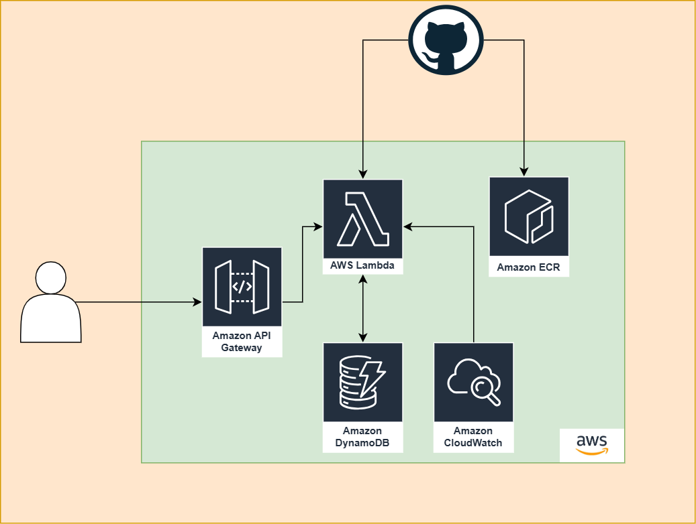

# 📌 Projeto – API Score de Credito

API de Score de Crédito desenvolvida para uso interno e externo, com foco em alta disponibilidade, escalabilidade e segurança. Retorna o score com base no CPF e utiliza cache com DynamoDB para otimizar desempenho. Infraestrutura provisionada na AWS via Terraform.

## 🏗️ Arquitetura


| Componente               | Função                                                                 |
|--------------------------|------------------------------------------------------------------------|
| **Usuário / Cliente**     | Faz requisição HTTP para a API Gateway (com API Key).                 |
| **API Gateway**           | Recebe a requisição, valida a API Key e encaminha para a Lambda.     |
| **AWS Lambda (Docker)**   | Roda o código Python da API. Consulta e atualiza cache no DynamoDB. Retorna a resposta para o API Gateway. |
| **DynamoDB**              | Banco NoSQL utilizado como cache para scores de crédito.              |
| **ECR**                   | Armazena a imagem Docker utilizada pela Lambda.                       |
| **CloudWatch**            | Armazena logs e métricas da execução da Lambda.                       |
| **GitHub Actions Pipeline** | Build da imagem, push para ECR, deploy da Lambda e provisionamento via Terraform da estrutura (IaC). |

## 📁 Estrutura

```bash
├── Dockerfile                  # Configuração da imagem Docker da aplicação
├── app                         # Código-fonte da API
│   ├── main.py                 # Ponto de entrada da aplicação FastAPI
│   ├── schemas.py              # Modelos Pydantic para validação e estrutura de dados
│   ├── services.py             # Lógica de negócio e cálculo do score
│   └── utils.py                # Funções auxiliares
├── docs
│   ├── api.md                  # Documentação da API
│   ├── decisoes-tecnicas.md    # Decisões técnicas
│   └── arquitetura.png         # Diagrama da arquitetura em imagem
│   └── start-projeto.md        # Passo a passo implantação do projeto 
│   └── melhorias.md            # Melhorias futuras para o projeto
├── requirements.txt            # Lista de dependências Python do projeto
└── terraform                   # Infraestrutura como código com Terraform
    ├── api_gateway.tf          # Configuração do API Gateway e integração com Lambda
    ├── data.tf                 # Recursos de dados reutilizáveis
    ├── dynamodb.tf             # Provisionamento da tabela DynamoDB (cache dos scores)
    ├── lambda.tf               # Deploy da função Lambda com a imagem Docker
    ├── locals.tf               # Definições de variáveis locais reutilizáveis
    ├── monitoring.tf           # Integração com CloudWatch para logs e métricas
    ├── outputs.tf              # Valores de saída da infraestrutura provisionada
    ├── provider.tf             # Provedor da AWS e configuração principal
    └── variables.tf            # Definição das variáveis utilizadas no projeto
```

## 📚 Documentações
[Decisões técnicas](docs/decisoes-tecnicas.md)<br>
[Start Projeto](docs/start-projeto.md)<br>
[Doc API](docs/api.md)<br>
[Melhorias](docs/melhorias.md)<br>